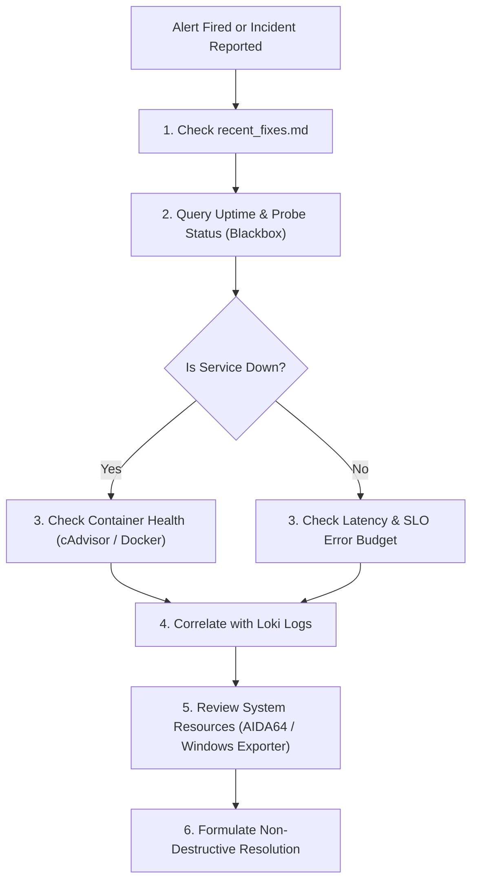

# DevOps Analyzer & Incident Response

A structured workflow for triage, anomaly investigation, and root-cause analysis across the homelab observability stack.

---

## Triage Protocol: Step-by-Step



---

### Step 1: Check Past Fixes First
> [!IMPORTANT]
> **Mandatory Homelab Invariant:** Always inspect [`recent_fixes.md`](file:///d:/observability/recent_fixes.md) before diagnosing infrastructure anomalies. Avoid re-diagnosing previously documented quirks or recurring container restart behaviors.

---

### Step 2: Evaluate Alert & Probe Scope
* **Scope Discipline:** Confirm whether the affected service belongs to `tier: prod` or `tier: dev`. Only production services trigger 24/7 alerts.
* Check probe status:
  ```promql
  probe_success{tier="prod"} == 0
  ```
* Check endpoint latency trend:
  ```promql
  probe_duration_seconds{tier="prod"}
  ```

---

### Step 3: Inspect Container Health & Resource Bounds
Query Prometheus (scraped from cAdvisor):
* **Container restarts:**
  ```promql
  time() - container_start_time_seconds{name!=""} < 300
  ```
* **Memory Working Set vs. Limits:**
  ```promql
  container_memory_working_set_bytes{name!=""} / container_spec_memory_limit_bytes{name!=""} > 0.85
  ```
* **OOM Kills:**
  Check whether containers were killed due to memory limits:
  ```logql
  {job="docker"} |= "oom"
  ```

---

### Step 4: Correlate with Loki Logs
* Retrieve the latest error entries for the affected container:
  ```logql
  {container=~".*<service>.*"} |= "error"
  ```
* Check for timeout or database connection issues:
  ```logql
  {container=~".*<service>.*"} |~ "timeout|connection refused|connection reset"
  ```

---

### Step 5: Hardware & System Capacity Check
* **Thermal Throttling:** Check if the host CPU is throttling (>85°C):
  ```promql
  aida64_temp_cpu_diode_celsius
  ```
* **Host Disk Space:** Check available disk space on `C:`, `D:`, and `F:`:
  ```promql
  windows_logical_disk_free_bytes
  ```

---

## Architectural Guardrails & Invariants

When designing a remediation or editing configurations:
1. **Never lower scrape intervals below 60s**: Preserves quiet home lab acoustics and prevents thermal spikes.
2. **Resource Constraints**: Every new or updated container in `docker-compose.yml` must define explicit `mem_limit` and `cpus`.
3. **Log Rotation**: Ensure `json-file` driver with `max-size: 10m` and `max-file: 3` is maintained.
4. **Validation**: Always run `docker compose config` before applying or restarting stacks.
